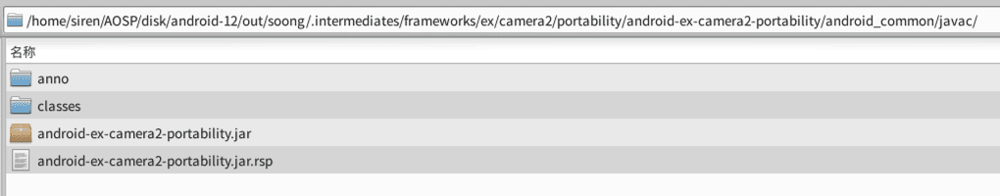
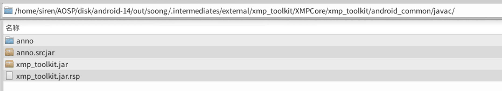

# [English](README.md) | 中文文档
## Camera2 from android-12.1.0_r11
### Camera2脱离源码在Android Studio的编译

### 惯例说明
* 不试图改变项目本身的目录结构
* 通过添加额外的配置和依赖构建Gradle环境支持
* 由于出现两张图片冲突 (res和res_p重复定义了两张同名图片)，所以Gradle在编译时会进行移除并做本地忽略

	```
	// 脚本移除重复定义的图片
	android.applicationVariants.all { variant ->
	    variant.preBuild.doFirst {
	        def filesToRemove = [
	                "res/drawable-xxhdpi/ic_refocus_normal.png",
	                "res/drawable-xxhdpi/ic_refocus_disabled.png"
	        ]
		
	        filesToRemove.each { relativePath ->
	            def file = file(relativePath)
	            if (file.exists()) {
	                file.delete()
	                println "Deleted: ${file.absolutePath}"
	                exec {
	                    commandLine 'git', 'update-index', '--assume-unchanged', file.absolutePath
	                }
	            }
	        }
	    }
	}
	```

* 因为使用push的方式进行安装和覆盖，libjni_tinyplanet和libjni_jpegutil两块暂不参与编译  
	PS:如果希望参与编译，可以引入对应的so文件，或者gradle配置ndkBuild的Android.mk路径,并确保安装了ninja


## 使用命令编译
### 环境依赖
*  Gradle 7.3.3
*  JDK version 11

```
# 构建环境
gradle wrapper

# 打包编译
./gradlew assemble
```

## 在Android Studio上编译
### 推荐使用
*  Android Studio Koala & JDK version 11

### 执行Android Studio上Build APK的操作, 然后将apk推送到设备上Camera2所在的目录

```
adb push Camera2.apk /system/priv-app/Camera2/

adb shell killall com.android.camera2
```
######  首次推送会起不来，需要重启一下设备
```
adb reboot
```


## 构建步骤

### Step：引入静态依赖


##### @android-ex-camera2-portability.jar:
```
// android-12/out/soong/.intermediates/frameworks/ex/camera2/portability/android-ex-camera2-portability/android_common/javac/android-ex-camera2-portability.jar
implementation files('libs/android-ex-camera2-portability.jar')
```



##### @xmp_toolkit.jar:
```
// android-12/out/soong/.intermediates/external/xmp_toolkit/XMPCore/xmp_toolkit/android_common/javac/xmp_toolkit.jar
implementation files('libs/xmp_toolkit.jar')
```



## 生成platform.keystore默认签名

在android-12/build/target/product/security路径下找到签名证书，并使用 [keytool-importkeypair](https://github.com/getfatday/keytool-importkeypair) 生成keystore,
执行如下命令：  

```
./keytool-importkeypair -k platform.keystore -p 123456 -pk8 platform.pk8 -cert platform.x509.pem -alias platform
```

并将以下代码添加到gradle配置中：

```
    signingConfigs {
        platform {
            storeFile file("platform.keystore")
            storePassword '123456'
            keyAlias 'platform'
            keyPassword '123456'
        }
    }

    buildTypes {
        release {
            debuggable false
            minifyEnabled false
            signingConfig signingConfigs.platform
        }

        debug {
            debuggable true
            minifyEnabled false
            signingConfig signingConfigs.platform
        }
    }
```

### PS:
##### 查看被忽略的文件列表
```
git ls-files -v | grep '^h\ '
```  

##### 忽略和还原单个文件
``` 
git update-index --assume-unchanged $path
git update-index --no-assume-unchanged $path
``` 

##### 还原全部被忽略的文件
```
git ls-files -v | grep '^h' | awk '{print $2}' |xargs git update-index --no-assume-unchanged 
```

---

### 关联项目
* [Settings](https://github.com/siren-ocean/Settings)
* [SystemUI](https://github.com/siren-ocean/SystemUI)
* [Launcher3](https://github.com/siren-ocean/Launcher3)
* [DocumentsUI](https://github.com/siren-ocean/DocumentsUI)
* [PermissionController](https://github.com/siren-ocean/PermissionController)