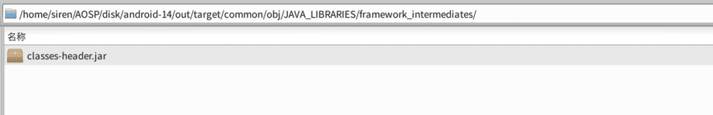

# English | [中文文档](README.cn.md)
## Camera2 from android-14.0.0_r67
### Building Camera2 outside AOSP source in Android Studio

### Support Notes
* Instead of changing the project's directory structure, we add additional configurations and dependencies to build Gradle environment support
* Due to image conflicts (res and res_p define two images with the same name), Gradle will remove and locally ignore them during compilation

	```
	// Script to remove duplicate image definitions
	android.applicationVariants.all { variant ->
	    variant.preBuild.doFirst {
	        def filesToRemove = [
	                "res/drawable-xxhdpi/ic_refocus_normal.png",
	                "res/drawable-xxhdpi/ic_refocus_disabled.png"
	        ]
		
	        filesToRemove.each { relativePath ->
	            def file = file(relativePath)
	            if (file.exists()) {
	                file.delete()
	                println "Deleted: ${file.absolutePath}"
	                exec {
	                    commandLine 'git', 'update-index', '--assume-unchanged', file.absolutePath
	                }
	            }
	        }
	    }
	}
	```

* Since we use push method for installation and overwriting, libjni_tinyplanet and libjni_jpegutil are not included in the build for now  
### PS: If you want to include them in the build, you can introduce the corresponding so files, or configure the Android.mk path for ndkBuild in gradle, and ensure ninja is installed.

## Building with Command Line
### Environment Requirements
*  Gradle 7.5
*  JDK version 17

```
# Setup build environment
gradle wrapper

# Build and package
./gradlew assemble
```


## Building in Android Studio
### Recommended
*  Android Studio Koala & JDK version 17

#### Execute Build APK in Android Studio, then push the apk to the Camera2 directory on the device
```
adb push Camera2.apk /system/priv-app/Camera2/

adb shell killall com.android.camera2
```
### PS: The first push may not start properly, you need to reboot the device.
```
adb reboot
```


## Build Steps

### Step 1: Add Static Dependencies

##### @framework.jar:
```
// android-14/out/target/common/obj/JAVA_LIBRARIES/framework_intermediates/classes-header.jar
compileOnly files('libs/framework.jar')
```



##### @android-ex-camera2-portability.jar:
```
// android-14/out/soong/.intermediates/frameworks/ex/camera2/portability/android-ex-camera2-portability/android_common/javac/android-ex-camera2-portability.jar
implementation files('libs/android-ex-camera2-portability.jar')
```


##### @xmp_toolkit.jar:
```
// android-14/out/soong/.intermediates/external/xmp_toolkit/XMPCore/xmp_toolkit/android_common/javac/xmp_toolkit.jar
implementation files('libs/xmp_toolkit.jar')
```


## Generate platform.keystore Default Signature

Find the signing certificates in the android-14/build/target/product/security path and use [keytool-importkeypair](https://github.com/getfatday/keytool-importkeypair) to generate the keystore.
Execute the following command:  

```
./keytool-importkeypair -k platform.keystore -p 123456 -pk8 platform.pk8 -cert platform.x509.pem -alias platform
```

And add the following code to the gradle configuration:

```
    signingConfigs {
        platform {
            storeFile file("platform.keystore")
            storePassword '123456'
            keyAlias 'platform'
            keyPassword '123456'
        }
    }

    buildTypes {
        release {
            debuggable false
            minifyEnabled false
            signingConfig signingConfigs.platform
        }

        debug {
            debuggable true
            minifyEnabled false
            signingConfig signingConfigs.platform
        }
    }
```

### PS:
##### View ignored file list
```
git ls-files -v | grep '^h\ '
```

##### Ignore and restore a single file
``` 
git update-index --assume-unchanged $path
git update-index --no-assume-unchanged $path
```

##### Restore all ignored files
```
git ls-files -v | grep '^h' | awk '{print $2}' |xargs git update-index --no-assume-unchanged 
```

---

### Related Projects
* [Settings](https://github.com/siren-ocean/Settings)
* [SystemUI](https://github.com/siren-ocean/SystemUI)
* [Launcher3](https://github.com/siren-ocean/Launcher3)
* [DocumentsUI](https://github.com/siren-ocean/DocumentsUI)
* [PermissionController](https://github.com/siren-ocean/PermissionController)