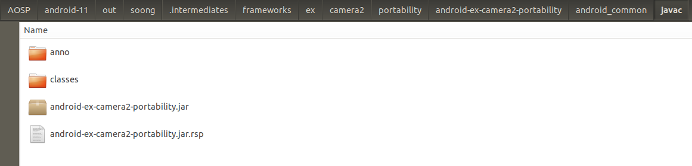

## Camera2 from android-11.0.0_r10
### Camera2脱离源码在Android Studiod的编译

### 惯例说明
* 不试图改变项目本身的目录结构
* 通过添加额外的配置和依赖构建Gradle环境支持
* 会使用脚本移除一些AS不支持的属性和字段，然后利用git本地忽略
* 由于出现两张图片冲突，并且gradle暂不支持sourceSets.res移除操作，所以仍然使用脚本做忽略移除（ic_refocus_normal.png 和 ic_refocus_disabled.png）
* 因为使用push的方式进行安装和覆盖，libjni_tinyplanet和libjni_jpegutil两块暂不参与编译  
	PS:如果希望参与编译，可以引入对应的so文件，或者gradle配置ndkBuild的Android.mk路径,并确保安装了ninja


## 执行步骤
#### 第一步：运行在Filter上的主函数，执行过滤任务


### 第二步：执行Android Studio上Build APK的操作, 然后将apk推送到设备上Camera2所在的目录

```
adb push Camera2.apk /system/priv-app/Camera2/

adb shell killall com.android.camera2
```
######  如果Camera2不能正常起来，则需要重启一下设备
```
adb reboot
```


## 构建步骤

### Step1：引入静态依赖
##### @framework.jar:
```
// AOSP/android-11/out/target/common/obj/JAVA_LIBRARIES/framework_intermediates/classes-header.jar
compileOnly files('libs/framework.jar')
```


##### @guava.jar:
```
// AOSP/android-11/out/soong/.intermediates/external/guava/guava/android_common/turbine-combined/guava.jar
implementation files('libs/guava.jar')
```


##### @android-ex-camera2-portability.jar:
```
// AOSP/android-11/out/soong/.intermediates/frameworks/ex/camera2/portability/android-ex-camera2-portability/android_common/javac/android-ex-camera2-portability.jar
implementation files('libs/android-ex-camera2-portability.jar')
```



##### @glide.jar:
```
// AOSP/android-11/out/soong/.intermediates/external/glide/glide/android_common/javac/glide.jar
implementation files('libs/glide.jar')
```


##### @xmp_toolkit.jar:
```
// AOSP/android-11/out/soong/.intermediates/external/xmp_toolkit/XMPCore/xmp_toolkit/android_common/javac/xmp_toolkit.jar
implementation files('libs/xmp_toolkit.jar')
```


##### @legacy-support-v13-1.1.0-alpha01.aar:
```
// AOSP/android-11/prebuilts/sdk/current/androidx-legacy/m2repository/androidx/legacy/legacy-support-v13/1.1.0-alpha01/legacy-support-v13-1.1.0-alpha01.aar
implementation(name: 'legacy-support-v13-1.1.0-alpha01', ext: 'aar')
```


###### ps: legacy-support-v13-1.1.0 在当前版本无法通过线上引用，故换成静态
```
## implementation 'androidx.legacy:legacy-support-v13-1.1.0-alpha01'
```


## 生成platform.keystore默认签名

在AOSP/android-11/build/target/product/security路径下找到签名证书，并使用 [keytool-importkeypair](https://github.com/getfatday/keytool-importkeypair) 生成keystore,
执行如下命令：  

```
./keytool-importkeypair -k platform.keystore -p 123456 -pk8 platform.pk8 -cert platform.x509.pem -alias platform
```

并将以下代码添加到gradle配置中：

```
    signingConfigs {
        platform {
            storeFile file("platform.keystore")
            storePassword '123456'
            keyAlias 'platform'
            keyPassword '123456'
        }
    }

    buildTypes {
        release {
            debuggable false
            minifyEnabled false
            signingConfig signingConfigs.platform
        }

        debug {
            debuggable true
            minifyEnabled false
            signingConfig signingConfigs.platform
        }
    }
```

### PS:
##### 查看被忽略的文件列表
```
git ls-files -v | grep '^h\ '
```  

##### 忽略和还原单个文件
``` 
git update-index --assume-unchanged $path
git update-index --no-assume-unchanged $path
``` 

##### 还原全部被忽略的文件
```
git ls-files -v | grep '^h' | awk '{print $2}' |xargs git update-index --no-assume-unchanged 
```

---

### 关联项目
* [Settings](https://github.com/siren-ocean/Settings)
* [SystemUI](https://github.com/siren-ocean/SystemUI)
* [Launcher3](https://github.com/siren-ocean/Launcher3)
* [DocumentsUI](https://github.com/siren-ocean/DocumentsUI)